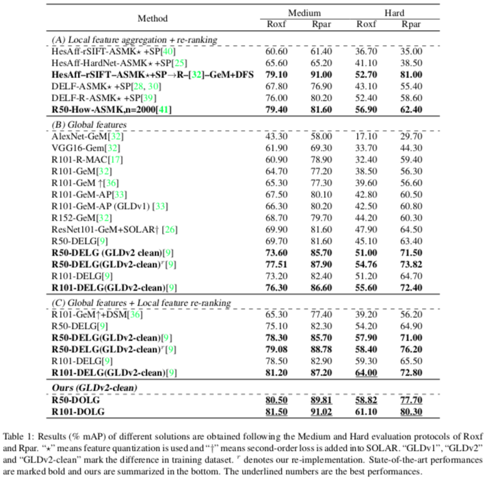

# DOLG: Single-Stage Image Retrieval with Deep Orthogonal Fusion of Local and Global Features (ICCV 2021)

## Pipeline


## Performances



## Codes
Please refer my **DELG**(https://github.com/feymanpriv/DELG) project to install and get started. 


## Wights
On the way ...


## Citation

If the project helps your research, please consider citing our paper as follows.

```BibTeX
@inproceedings{yang2021dolg,
  title = {DOLG: Single-Stage Image Retrieval with Deep Orthogonal Fusion of Local and Global Features},
  author = {Min Yang and Dongliang He and Miao Fan and Baorong Shi and Xuetong Xue and Fu Li and Errui Ding and Jizhou Huang},
  booktitle = {Proceedings of the IEEE/CVF International Conference on Computer Vision (ICCV)},
  year = {2021}
}

```
