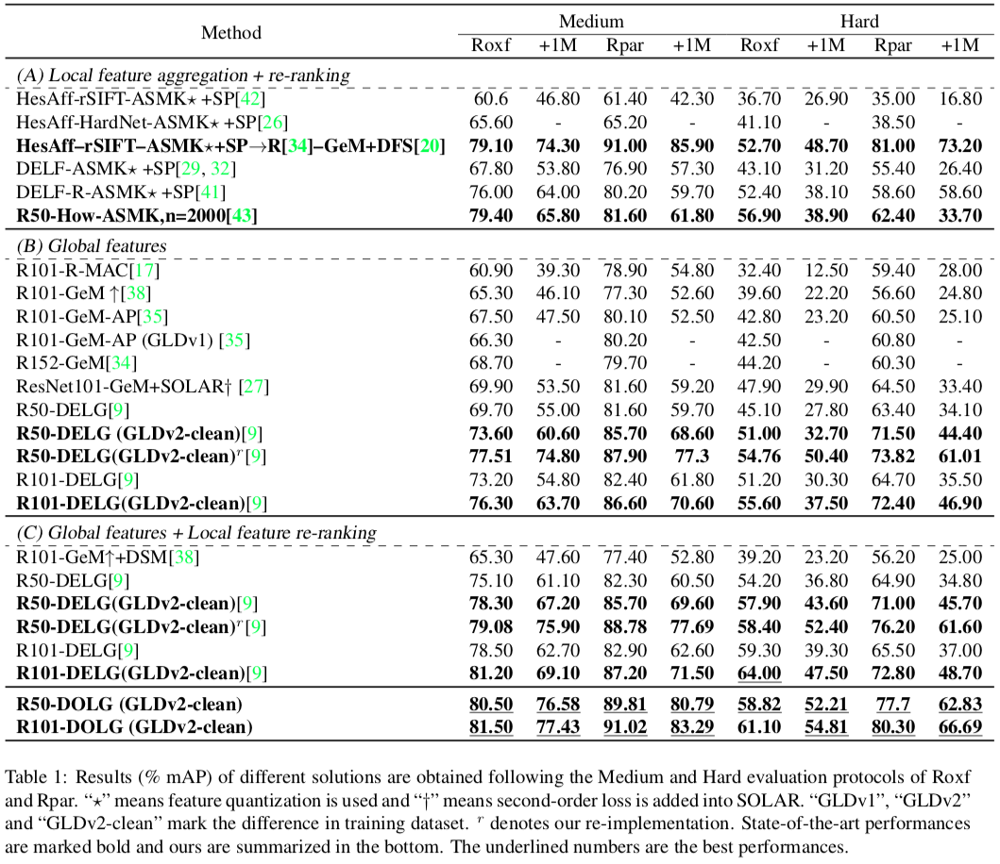

# DOLG: Single-Stage Image Retrieval with Deep Orthogonal Fusion of Local and Global Features (ICCV 2021)

## Pipeline
<p align="center"></p>


## Performances
<p align="center"></p>

**modified results (should follow cropping results)**

|  			 					 | Roxf-M | +1M | Rpar-M | +1M   | Roxf-H | +1M  | Rpar-H | +1M  |
|:------------------------------:|:------:|:---:|:------:|:-----:|:------:|:----:|:------:|:----:|
|  DOLG-R50(with query cropping) |  81.20 |  -- | 90.07  |       |  62.55 |  --  | 79.20  |      |
|  DOLG-R101(with query cropping)|  82.37 |  -- | 90.97  |       |  64.93 |  --  | 81.71  |      |
|                                                                                                |
|  DOLG-R50(w/o query cropping)  |  82.38 |     | 90.94  |       |  62.92 |      | 80.48  |      | 
|  DOLG-R101(w/o query cropping) |  83.22 |     | 91.64  |       |  64.83 |      | 82.56  |      |

+1M results is on going.

## Codes

### Requirements

- NVIDIA GPU, Linux, Python3(tested on 3.6.10)
- Tested with CUDA 10.2, cuDNN 7.1 and PyTorch 1.4.0

```
pip install -r requirements.txt
```

### Training

1. Find datasets via symlinks from `datasets/data` to the actual locations where the dataset images and annotations are stored. Refer to [`DATA.md`](imgs/DATA.md).

2. Set datapath, model, training parameters in configs/resnet101_delg_8gpu.yaml and run 

```
python train.py \
    --cfg configs/resnet101_delg_8gpu.yaml \
    OUT_DIR ./output \
    PORT 13001 \
    TRAIN.WEIGHTS ./pretrained/R-101-1x64d_dds_8gpu.pyth
```

### Evaluation

1. ROxf and RPar feature extraction, set ${total_num}=1 and run 

```
python evaler/infer.py --cfg configs/resnet101_delg_8gpu.yaml
```

2. 1M distractor feature extraction, set ${total_num} = n * ${gpu_cards} in **configs/resnet101_delg_8gpu.yaml** and run 

```
sh scripts/run_extractor.sh configs/resnet101_delg_8gpu.yaml
```

3. Eval on ROxf and RPar, refer [`README.md`](revisitop/README.md) for data fetch and description. Groudtruth file and some examples are prepared in [revisitop](https://github.com/feymanpriv/DOLG/tree/main/revisitop). 


### Wights

- [R-50-DOLG](https://pan.baidu.com/s/13Bt1v_sMSny8pGRIM0K8xQ) (d7or)   - [R-101-DOLG](https://pan.baidu.com/s/1_osEyC53txA-_1cbadBzLQ) (nqdb)


## Citation

If the project helps your research, please consider citing our paper as follows.

```BibTeX
@InProceedings{Yang_2021_ICCV,
    author={Yang, Min and He, Dongliang and Fan, Miao and Shi, Baorong and Xue, Xuetong and Li, Fu and Ding, Errui and Huang, Jizhou},
    title={DOLG: Single-Stage Image Retrieval With Deep Orthogonal Fusion of Local and Global Features},
    booktitle={Proceedings of the IEEE/CVF International Conference on Computer Vision (ICCV)},
    month={October},
    year={2021},
    pages={11772-11781}
}

```


## References

pycls(https://github.com/facebookresearch/pycls)
pymetric(https://github.com/feymanpriv/pymetric)
DELG(https://github.com/feymanpriv/DELG)
Parsing-R-CNN(https://github.com/soeaver/Parsing-R-CNN)
